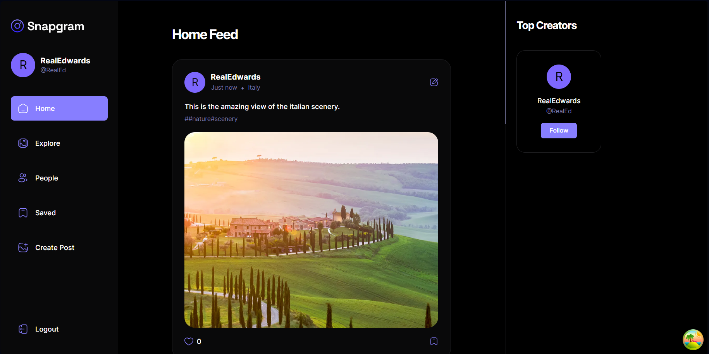

# Social Media App

A modern looking social media application where users can post their best moments and share their lives with the rest of the world, and see what others post as well, and follow the story of others.

In this application, you can upload your story and reveal your voices to the world !

Live demo at : https://social-media-clone-cdwn.onrender.com

or 
Live demo at : https://social-media-clone-delta.vercel.app




# About

I build this project simply to learn about the modern frontend techstacks, using React.js, typescripts and tailwindcss, as well as modern UI library like Radix UI, to create a visually appeasing and mobile compactible react application, supported by Appwrite, a third-party backend software services, that provides features like database, storage for media, user authetication and server side functions, all in one packages.

# Tech Stack

- React
- TypeScript
- TailwindCSS
- Radix UI
- Appwrite
- Vite

# Try this example on your local

```bash
npm install
```

This will download the files and install the necessary dependencies automatically.

Once it's done, go to the directory and run the following command to start the project:

```bash
npm run dev
```

Open http://localhost:5173 in your browser to view the project.
